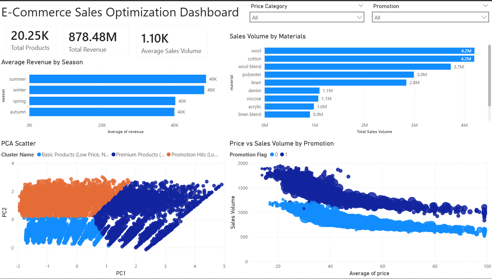

# E-Commerce Sales Optimization

## 📌 Project Overview

This project analyzes e-commerce sales data to identify sales trends, customer behavior, product performance, and business opportunities.

The project combines **Exploratory Data Analysis (EDA)** using Python with an interactive **Power BI Dashboard** to transform raw sales data into meaningful business insights.

---

## 🎯 Project Objectives

The main objectives of this project are:

* Analyze overall sales performance.
* Identify the best-performing products and categories.
* Analyze sales trends over time.
* Understand customer purchasing behavior.
* Identify high-performing regions.
* Analyze revenue and order patterns.
* Extract actionable business insights.
* Build an interactive Power BI dashboard for decision-making.

---

## 🛠️ Tools & Technologies

* Python
* Pandas
* NumPy
* Matplotlib
* Seaborn
* Jupyter Notebook
* Power BI
* CSV
* Git & GitHub

---

## 📂 Project Structure

```text
E-Commerce-Sales-Optimization/
│
├── data/
│   ├── Business_sales_EDA.csv
│   └── ecommerce_sales_dashboard.csv
│
├── notebooks/
│   └── Commerce Sales Optimization.ipynb
│
├── dashboard/
│   ├── Data Analysis Dashboard.pbix
│   └── Dashboard.png
│
├── README.md
├── .gitignore
└── LICENSE
```

---

## 🔎 Exploratory Data Analysis

The Python notebook performs exploratory data analysis to understand the structure and behavior of the sales data.

The analysis includes:

* Data loading and inspection
* Data cleaning
* Missing-value analysis
* Duplicate-value analysis
* Statistical analysis
* Sales analysis
* Product analysis
* Category analysis
* Customer analysis
* Time-based analysis
* Visualization of key business metrics

---

## 📊 Power BI Dashboard

An interactive Power BI dashboard was created to provide a visual overview of the e-commerce business performance.

### Dashboard Preview



The dashboard helps analyze:

* Total Sales
* Total Orders
* Product Performance
* Category Performance
* Sales Trends
* Customer Behavior
* Regional Performance

---

## 💡 Business Insights

The analysis aims to answer important business questions such as:

1. Which products generate the highest sales?
2. Which categories perform best?
3. How do sales change over time?
4. Which regions contribute the most revenue?
5. What are the main sales trends?
6. Which products or categories may require optimization?
7. What opportunities exist for improving sales performance?

---

## 🚀 Key Skills Demonstrated

This project demonstrates practical skills in:

* Data Cleaning
* Exploratory Data Analysis
* Data Visualization
* Business Analysis
* KPI Analysis
* Power BI Dashboard Development
* Python for Data Analysis
* Data Storytelling
* Git & GitHub

---

## 📈 Project Workflow

```text
Raw Data
   ↓
Data Cleaning
   ↓
Exploratory Data Analysis
   ↓
Business Analysis
   ↓
Data Visualization
   ↓
Power BI Dashboard
   ↓
Business Insights
   ↓
Sales Optimization
```

---

## 👨‍💻 Author

**Mohamed Saad**

Computer Science / Data & AI Enthusiast

GitHub: [Add your GitHub profile here]

LinkedIn: [Add your LinkedIn profile here]
